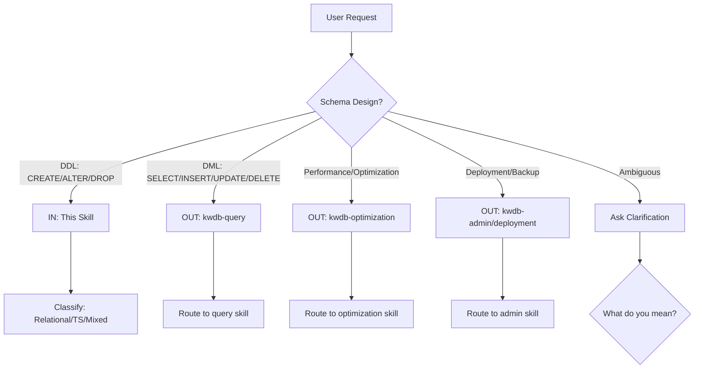

# Skill Scope and Boundaries

This document defines what this skill handles and what it should NOT handle.

---

## IN Scope (This Skill)

### DDL Operations
| Operation | Examples |
|-----------|----------|
| CREATE TABLE | Relational tables, Time-series tables (TAGS, PRIMARY TAGS) |
| ALTER TABLE | ADD/DROP/RENAME COLUMN, ADD CONSTRAINT, SET RETENTIONS |
| DROP TABLE | With CASCADE considerations |
| CREATE/DROP INDEX | B-tree, composite, covering, tag index |
| Constraints | PRIMARY KEY, FOREIGN KEY, UNIQUE, CHECK |
| Views | CREATE VIEW, CREATE MATERIALIZED VIEW, REFRESH |
| Sequences | CREATE SEQUENCE, nextval(), unique_rowid(), gen_random_uuid() |
| Partitioning | LIST, RANGE, HASH (relational), HASHPOINT (time-series) |
| Retention | SET RETENTIONS for time-series tables |

### Design Decisions
- Workload classification (relational / time-series / mixed)
- Column type selection
- Primary key strategy
- Index design (when to add, column order)
- Tag design for time-series tables
- Retention policy selection

### Trigger Keywords
- KWDB + schema/table/index/view
- sensor, IoT, metrics, logs, readings
- TAGS, PRIMARY TAGS, RETENTIONS
- create table, add column, create index
- primary key, foreign key, constraints

---

## OUT of Scope (Other Skills)

### Should Route To

| User Asks For... | Route To... | Example |
|------------------|-------------|---------|
| DML queries | kwdb-query | "SELECT * FROM users WHERE..." |
| INSERT/UPDATE/DELETE | kwdb-query | "Insert a record into..." |
| Query optimization | kwdb-optimization | "Speed up this slow query" |
| Performance tuning | kwdb-optimization | "EXPLAIN ANALYZE..." |
| Index recommendations | kwdb-optimization | "Which indexes should I add?" |
| Deployment | kwdb-deployment | "How to deploy KWDB" |
| Backup/Restore | kwdb-admin | "Backup this database" |
| Cluster setup | kwdb-deployment | "Set up KWDB cluster" |
| User management (explicit) | Use kwdb-schema-design only if requested | "create a user" → NOT trigger |
| Replication | kwdb-admin | "Set up replication" |
| SQL functions (non-DDL) | kwdb-query | "How to write a stored function" |

### Clear Examples

**IN Scope:**
- "Design a KWDB table for storing sensor readings"
- "Create an index on the orders table"
- "Add a CHECK constraint to ensure price > 0"
- "What's the difference between relational and time-series tables?"

**OUT of Scope:**
- "How do I query all orders from 2024?" → kwdb-query
- "My query is slow, help optimize it" → kwdb-optimization
- "Set up a 3-node KWDB cluster" → kwdb-deployment

---

## Ambiguous Cases

| User Says... | Should... |
|--------------|-----------|
| "How should I store..." | IN - schema design |
| "How do I query..." | OUT - DML/query |
| "Optimize this table" | Ask: "Schema change or query tuning?" |
| "Add performance" | Ask: "Add indexes (schema) or rewrite query?" |
| "Design a system for..." | IN - likely schema design |
| "Get data from..." | OUT - DML |
| "I want to analyze..." | Ask: "Design schema or write queries?" |

---

## Guardrails

1. **Never answer DML/query questions** - Route to kwdb-query skill
2. **Never answer performance tuning** - Route to kwdb-optimization skill
3. **Never answer deployment questions** - Route to kwdb-deployment skill
4. **If ambiguous, ask clarifying question** first
5. **If user says "how to..." without schema context**, ask: "Are you designing the schema or writing queries?"

---

## Boundary Check Flow

---

**Remember:** This skill is about *designing* the structure, not *manipulating* or *querying* the data.
