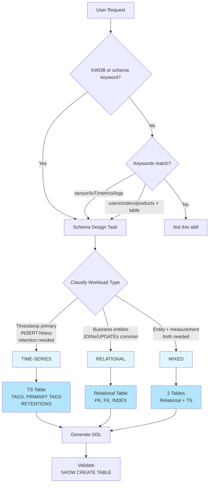

# Key Rules

KWDB schema design core rules. **ALWAYS READ THIS FIRST.**

## Decision Tree



### Text Version

```
User request → Classify workload type:
├── 实体数据 + 需要JOIN/UPDATE → RELATIONAL
├── 时间戳为主 + 传感器/监控 + INSERT为主 → TIME-SERIES
└── 两者都有 → MIXED
```

## Rule 0: Classify BEFORE DDL

Always classify as relational / time-series / mixed BEFORE outputting DDL.

### Common Mistakes

| Wrong | Right | Why |
|-------|-------|-----|
| Output DDL without classifying | Ask: "Is this time-series or relational data?" | Classification determines syntax (TAGS vs relational) |
| Assume relational for sensor data | Classify: time-series | Time-series tables have special syntax (TAGS, RETENTIONS) |
| Assume time-series for user data | Classify: relational | User data needs JOINs, updates - not time-series |

---

## Rule 1: Type Selection

| Choose... | When... |
|-----------|---------|
| RELATIONAL | Business entities, CRUD, JOINs, UPDATE/DELETE common |
| TIME-SERIES | Timestamp primary, sensors/metrics, INSERT-heavy, retention needed |
| MIXED | Both entity + measurement data |

## Rule 2: Column Types (Quick)

| Data | Type |
|------|------|
| IDs ≤2B | INT4 |
| IDs >2B / distributed | INT8 or UUID |
| Money/exact decimals | DECIMAL(p,s) |
| Measurements (approx) | FLOAT8 |
| Low-precision (temp, humidity) | FLOAT4 |
| Short text | VARCHAR(n) |
| JSON data | JSONB |
| Timestamps | TIMESTAMPTZ (TS tables) |
| Boolean | BOOL |

### Common Mistakes

| Wrong | Right | Why |
|-------|-------|-----|
| `price FLOAT` | `price DECIMAL(10,2)` | FLOAT 有精度损失，金额必须用 DECIMAL |
| `id VARCHAR(50)` | `id INT8` or `UUID` | 整数/UUID 索引性能更好 |
| `name CHAR(100)` | `name VARCHAR(100)` | CHAR 固定长度浪费空间 |
| `status INT` (0/1) | `status BOOL` or `VARCHAR(20)` | 语义更清晰 |
| `temperature DECIMAL(5,2)` | `temperature FLOAT4` | 测量值用 FLOAT4/8，节省空间 |

**Avoid**: FLOAT for money, VARCHAR without length for structured data

---

## Rule 3: Primary Keys

| Scenario | Recommendation |
|----------|---------------|
| Single table, no FK | INT8 DEFAULT unique_rowid() |
| Multi-table with FK | Explicit UUID or INT |
| Distributed | UUID DEFAULT gen_random_uuid() |
| Natural key stable | Use natural key |

**TS tables**: First column = TIMESTAMPTZ, device ID as primary tag

### Common Mistakes

| Wrong | Right | Why |
|-------|-------|-----|
| No PK defined | `id INT8 DEFAULT unique_rowid() PRIMARY KEY` | 无 PK 会生成隐藏 rowid，显式声明更清晰 |
| `INT4` for large systems | `INT8` or `UUID` | INT4 最大 21 亿，容易溢出 |
| `serial` without DEFAULT | `DEFAULT unique_rowid()` | KWDB 推荐 unique_rowid() |
| Composite PK on TS tables | Timestamp + PRIMARY TAGS | TS 表必须使用 TAGS 语法 |

---

## Rule 4: When to Add Index

Add index when column appears in: WHERE, JOIN, ORDER BY, GROUP BY

**TS tag index**: Only on tags (max 4), types: INT/FLOAT/CHAR/NCHAR
**No index**: TIMESTAMP, GEOMETRY, primary tags

### Common Mistakes

| Wrong | Right | Why |
|-------|-------|-----|
| Index on boolean column | No index | 低基数列索引无效果 |
| `CREATE INDEX ON ts_table (k_timestamp)` | No timestamp index | TS 表 timestamp 自动索引 |
| Index every column "for performance" | Index only query columns | 索引过多影响写入性能 |
| Index on FLOAT primary tag | Not allowed | 主标签不能用 FLOAT |
| `CREATE INDEX ON ts_table (GEOMETRY)` | Not supported | TS 表不支持 GEOMETRY 索引 |

---

## Rule 5: Constraints

| Type | Use When |
|------|----------|
| CHECK | Value validation |
| UNIQUE | No duplicates |
| FOREIGN KEY | Refer integrity (column MUST be indexed) |

## Rule 6: Time-Series Specific

- **Tags**: Filter/GROUP BY, low cardinality preferred
- **Data columns**: Actual measurements
- **Primary tags**: Max 4, NOT NULL, no TIMESTAMP/GEOMETRY/FLOAT
- **Retention**: State assumption if not specified (default: 180d)

## Rule 7: Partitioning

| Type | Use When |
|------|----------|
| LIST | Categorical values (region, type) |
| RANGE | Time/data ranges |
| HASH | Even distribution |
| HASHPOINT (TS) | Partition by tag values |

## Rule 8: DDL Scope

This skill handles **schema DDL**, not:
- DML (INSERT, UPDATE, DELETE, SELECT)
- Database administration (backup, restore)
- User/permission management (unless explicitly requested)

## Rule 9: Design Principles

1. Start minimal
2. State assumptions
3. Validate DDL
4. Prefer NOT NULL for required fields

## Tiered References

| Tier | Files | When to Read |
|------|-------|--------------|
| Core | key-rules.md, disambiguation.md | Always |
| High-Freq | table-ddl-ref.md, index-ddl-ref.md, constraint-ref.md | Designing tables/indexes/constraints |
| Medium | view-ref.md, sequence-ref.md, partitioning-ref.md, retention-ref.md | When needed |
| Low | trigger-ref.md, procedure-ref.md, database-ref.md, privilege-ref.md | Only when asked |

---
**For detailed reference**, see the tiered reference files above.
