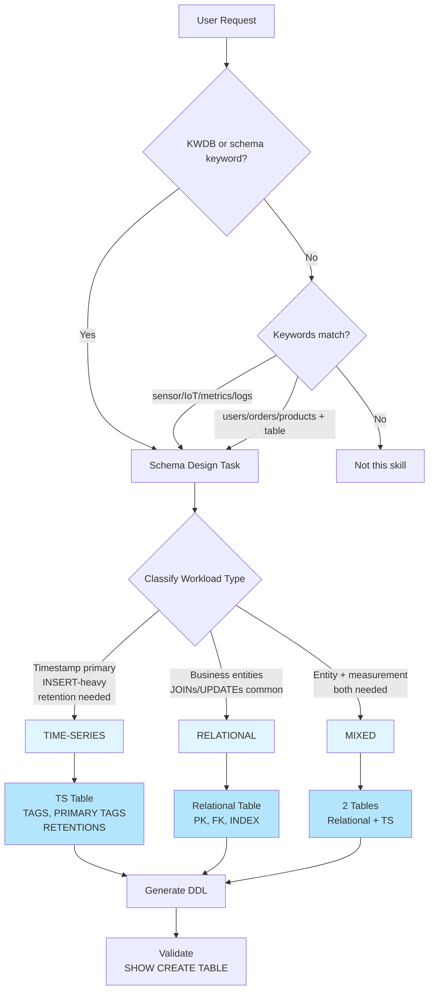

# Key Rules

KWDB schema design core rules. **ALWAYS READ THIS FIRST.**

## Rule 0: ALWAYS Invoke Skill First

Before designing any KWDB schema, invoke the `kwdb-schema-design` skill via the Skill tool.

| Situation | Action |
|-----------|--------|
| New conversation | Use Skill tool first |
| Session restored (compact) | Use Skill tool — context ≠ skill loaded |
| Reference files in context | Still use Skill tool |
| You "know" the syntax | Still use Skill tool |

**Why**: Skill invocation triggers the complete workflow and guardrails. Reading files directly skips validation steps.

## Decision Tree



### Text Version

```
User request → Classify workload type:
├── 实体数据 + 需要JOIN/UPDATE → RELATIONAL
├── 时间戳为主 + 传感器/监控 + INSERT为主 → TIME-SERIES
└── 两者都有 → MIXED
```

## Rule 0: Classify BEFORE DDL

Always classify as relational / time-series / mixed BEFORE outputting DDL.

### Common Mistakes

| Wrong | Right | Why |
|-------|-------|-----|
| Output DDL without classifying | Ask: "Is this time-series or relational data?" | Classification determines syntax (TAGS vs relational) |
| Assume relational for sensor data | Classify: time-series | Time-series tables have special syntax (TAGS, RETENTIONS) |
| Assume time-series for user data | Classify: relational | User data needs JOINs, updates - not time-series |

---

## Rule 1: Type Selection

| Choose... | When... |
|-----------|---------|
| RELATIONAL | Business entities, CRUD, JOINs, UPDATE/DELETE common |
| TIME-SERIES | Timestamp primary, sensors/metrics, INSERT-heavy, retention needed |
| MIXED | Both entity + measurement data |

**Mixed workload note**: If the "entity" is just static metadata (device location, model, install date) attached to time-series readings, put it as TAGS in a single time-series table. Only create separate relational tables when the entity needs independent CRUD operations or complex relationships.

## Rule 2: Column Types (Quick)

### Relational Tables

| Data | Type |
|------|------|
| IDs ≤2B | INT4 |
| IDs >2B / distributed | INT8 or UUID |
| Money/exact decimals | DECIMAL(p,s) |
| Measurements (approx) | FLOAT8 |
| Low-precision (temp, humidity) | FLOAT4 |
| Short text | VARCHAR(n) |
| JSON data | JSONB |
| Timestamps | TIMESTAMPTZ (TS tables) |
| Boolean | BOOL |

### Time-Series Tables — Data Column Types

| Data | Type | Notes |
|------|------|-------|
| Measurements | FLOAT4 / FLOAT8 | 推荐类型 |
| Counters / IDs | INT2 / INT4 / INT8 | — |
| Short text | CHAR / VARCHAR | — |
| Flags | BOOL | — |
| ~~Money/exact decimals~~ | ~~DECIMAL~~ ❌ | TS 表不支持 DECIMAL |
| ~~JSON / complex~~ | ~~JSONB~~ ❌ | TS 表不支持 JSONB |
| ~~UUID~~ | ~~UUID~~ ❌ | TS 表不支持 UUID |

**TS 表数据列支持的类型**: INT2, INT4, INT8, FLOAT4, FLOAT8, CHAR, VARCHAR, BOOL, TIMESTAMP, TIMESTAMPTZ
**TS 表数据列不支持的类型**: DECIMAL, NUMERIC, JSONB, UUID, ARRAY, GEOMETRY, BYTES
**Error**: `ERROR: column xxx: unsupported column type decimal in timeseries table`

### Common Mistakes

| Wrong | Right | Why |
|-------|-------|-----|
| `price FLOAT` (relational) | `price DECIMAL(10,2)` | FLOAT 有精度损失，金额必须用 DECIMAL |
| `price DECIMAL(18,4)` (TS table) | `price FLOAT8` | TS 表不支持 DECIMAL，用 FLOAT8 替代 |
| `id VARCHAR(50)` | `id INT8` or `UUID` | 整数/UUID 索引性能更好 |
| `name CHAR(100)` | `name VARCHAR(100)` | CHAR 固定长度浪费空间 |
| `status INT` (0/1) | `status BOOL` or `VARCHAR(20)` | 语义更清晰 |
| `temperature DECIMAL(5,2)` | `temperature FLOAT4` | 测量值用 FLOAT4/8，节省空间 |

**Avoid**: FLOAT for money (relational), DECIMAL in TS tables, VARCHAR without length for structured data

---

## Rule 3: Primary Keys

| Scenario | Recommendation |
|----------|---------------|
| Single table, no FK | `INT8 DEFAULT unique_rowid()` |
| Multi-table with FK | Explicit UUID or INT |
| Distributed | `UUID DEFAULT gen_random_uuid()` |
| Natural key stable | Use natural key |

**Important**: `unique_rowid()` 返回 **INT8**，不能用于 INT4 列。
- **Error**: `ERROR: The type of the default expression does not match the type of the column (column xxx)`
- **Correct**: `id INT8 DEFAULT unique_rowid() PRIMARY KEY`

**TS tables**: First column = TIMESTAMPTZ, device ID as primary tag

### Common Mistakes

| Wrong | Right | Why |
|-------|-------|-----|
| No PK defined | `id INT8 DEFAULT unique_rowid() PRIMARY KEY` | 无 PK 会生成隐藏 rowid，显式声明更清晰 |
| `id INT4 DEFAULT unique_rowid()` | `id INT8 DEFAULT unique_rowid()` | unique_rowid() 返回 INT8，不能用于 INT4 |
| `INT4` for large systems | `INT8` or `UUID` | INT4 最大 21 亿，容易溢出 |
| `serial` without DEFAULT | `DEFAULT unique_rowid()` | KWDB 推荐 unique_rowid() |
| Composite PK on TS tables | Timestamp + PRIMARY TAGS | TS 表必须使用 TAGS 语法 |

---

## Rule 4: When to Add Index

Add index when column appears in: WHERE, JOIN, ORDER BY, GROUP BY

**TS tag index**: Only on tags (max 4), types: INT2/4/8, FLOAT4/8, CHAR, NCHAR, BOOL. NOT supported: VARCHAR, NVARCHAR
**No index**: TIMESTAMP, GEOMETRY, primary tags
**Before creating**: Check `SHOW INDEX` — UNIQUE constraints and FK auto-indexes may already cover the column

### Common Mistakes

| Wrong | Right | Why |
|-------|-------|-----|
| Index on boolean column | No index | 低基数列索引无效果 |
| `CREATE INDEX ON ts_table (k_timestamp)` | No timestamp index | TS 表 timestamp 自动索引 |
| Index every column "for performance" | Index only query columns | 索引过多影响写入性能 |
| Index on FLOAT primary tag | Not allowed | 主标签不能用 FLOAT |
| `CREATE INDEX ON ts_table (GEOMETRY)` | Not supported | TS 表不支持 GEOMETRY 索引 |
| `CREATE INDEX idx ON t (fk_col)` after FK | No need | KWDB 为 FK 列自动创建索引（`<table>_auto_index_<fk_name>`），手动再建会重复 |

---

## Rule 5: Constraints

| Type | Use When | Relational | TS Table |
|------|----------|:----------:|:--------:|
| CHECK | Value validation | ✅ | ❌ |
| UNIQUE | No duplicates | ✅ | ❌ |
| FOREIGN KEY | Refer integrity (column MUST be indexed) | ✅ | ❌ |
| PRIMARY KEY | Row identity | ✅ | ✅ (timestamp + primary tags) |

**TS 表约束限制**:
- TS 表不支持 CHECK、UNIQUE、FOREIGN KEY 约束
- **Error**: `ERROR: check constraint is not supported in timeseries table`
- **Workaround**: 在应用层做数据校验

## Rule 6: Time-Series Specific

- **Database prerequisite**: Time-series tables MUST be created in a TS database (`CREATE TS DATABASE`). Check with `SHOW DATABASES;` first.
- **Tags**: Filter/GROUP BY, low cardinality preferred
- **Tag types**: Only INT2/INT4/INT8, FLOAT4/FLOAT8, CHAR, VARCHAR, BOOL. NOT supported: UUID, DATE, TIMESTAMPTZ, DECIMAL, JSONB
- **Data column types**: Only INT2/INT4/INT8, FLOAT4/FLOAT8, CHAR, VARCHAR, BOOL, TIMESTAMP, TIMESTAMPTZ. NOT supported: DECIMAL, NUMERIC, JSONB, UUID, ARRAY, GEOMETRY, BYTES
- **Primary tags**: Max 4, NOT NULL, no TIMESTAMP/GEOMETRY/FLOAT
- **Retention**: State assumption if not specified (default: 180d)
- **No CHECK/UNIQUE/FK constraints**: TS 表不支持 CHECK、UNIQUE、FOREIGN KEY 约束
- **No VIEW on TS tables**: 不能在 TS 表上创建 VIEW 或 MATERIALIZED VIEW
  - **Error**: `ERROR: create view is not supported in timeseries table` / `ERROR: create view is not supported in timeseries databases`
  - **Workaround**: 直接用 SQL 查询（支持跨库 JOIN），或在关系型库建聚合结果表

## Rule 7: Partitioning

| Type | Use When |
|------|----------|
| LIST | Categorical values (region, type) |
| RANGE | Time/data ranges |
| HASH | Even distribution |
| HASHPOINT (TS) | Partition by tag values |

**HASHPOINT syntax note**: `VALUES IN` 必须用方括号 `[]`（如 `VALUES IN [0]`），不能用圆括号。圆括号 `VALUES IN (...)` 是 `PARTITION BY HASH` 的语法。

## Rule 8: DDL Scope

This skill handles **schema DDL**, not:
- DML (INSERT, UPDATE, DELETE, SELECT)
- Database administration (backup, restore)
- User/permission management (unless explicitly requested)

## Rule 9: Design Principles

1. Start minimal
2. State assumptions
3. Validate DDL
4. Prefer NOT NULL for required fields

## Tiered References

| Tier | Files | When to Read |
|------|-------|--------------|
| Core | key-rules.md, disambiguation.md | Always |
| High-Freq | table-ddl-ref.md, index-ddl-ref.md, constraint-ref.md | Designing tables/indexes/constraints |
| Medium | view-ref.md, sequence-ref.md, partitioning-ref.md, retention-ref.md | When needed |
| Low | trigger-ref.md, procedure-ref.md, database-ref.md, privilege-ref.md | Only when asked |

---
**For detailed reference**, see the tiered reference files above.
